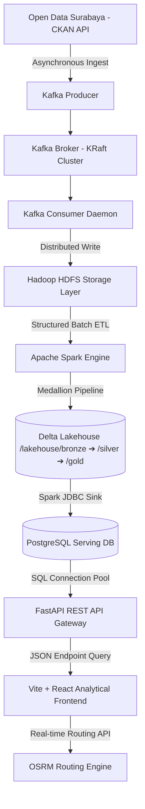
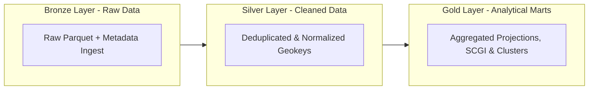

# DOKUMENTASI EKSEKUTIF & TEKNIS PROYEK AKHIR
## Sistem Audit Ketimpangan Kapasitas Pendidikan Dasar Kota Surabaya Berbasis Arsitektur Data Lakehouse dan Predictive School Capacity Analytics

---

## 1. Latar Belakang & Urgensi Solusi (Business Case)

### 1.1 Masalah Riil Sektor Pendidikan
Setiap tahun, proses Penerimaan Peserta Didik Baru (PPDB) tingkat Sekolah Dasar (SD) di Kota Surabaya menghadapi permasalahan kompleks terkait zonasi dan daya tampung. Keterbatasan daya tampung sekolah negeri dan ketimpangan penyebaran fasilitas pendidikan memicu konflik sosial tahunan. Isu ini secara konsisten menjadi sorotan media lokal (*Jawa Pos*, *Suara Surabaya*, *Detik Jatim*), khususnya pada rentang Juni–Juli.

## Referensi Berita

- [JPPI: SPMB 2025 Masih Diskriminatif](https://www.kompas.com/edu/read/2025/06/23/153243771/jppi-spmb-2025-masih-diskriminatif)

Meskipun Pemerintah Kota Surabaya menyediakan data terbuka melalui **Open Data Surabaya**, data tersebut masih bersifat deskriptif dan sektoral terpisah. Belum ada sistem yang mampu memberikan jawaban strategis mengenai:
1. Proyeksi kebutuhan bangku sekolah dasar untuk 3–5 tahun mendatang.
2. Pemetaan kecamatan yang berpotensi mengalami defisit kapasitas kritis.
3. Estimasi jumlah calon siswa yang berisiko tidak tertampung di wilayah domisilinya.
4. Rekomendasi lokasi prioritas pembangunan Unit Sekolah Baru (USB) maupun penambahan Ruang Kelas Baru (RKB).

### 1.2 Justifikasi Pemanfaatan Teknologi Data (Kerangka Kerja 5V)
Sistem ini menggunakan arsitektur Big Data untuk mengolah data secara komprehensif dengan karakteristik:
* **Volume**: Mengolah historis multi-year dari 7 dataset sektoral demografi dan pendidikan dasar kota Surabaya secara terpadu.
* **Velocity**: Sistem dirancang untuk pemrosesan berbasis *micro-batch* (via Kafka) dan sinkronisasi berkecepatan tinggi ke serving layer PostgreSQL.
* **Variety**: Integrasi beragam format data meliputi data demografi penduduk kelurahan, profil akreditasi sekolah, statistik siswa/guru, serta spasial GeoJSON batas wilayah.
* **Veracity**: Menangani anomali data riil seperti *missing values*, duplikasi koordinat, dan inkonsistensi penamaan kecamatan (misal: penyatuan nama kecamatan `ASEM ROWO` dan `ASEMROWO`).
* **Value**: Mentransformasikan data mentah menjadi sistem pendukung keputusan (*Decision Support System*) berbasis prediksi spasial-geografis.

### 1.3 Analisis Kesenjangan Solusi (Gap Analysis)

| Dimensi Kemampuan | Platform Informasi Eksisting (Open Data Surabaya) | Solusi Sistem Prediktif Terintegrasi |
| :--- | :--- | :--- |
| **Sifat Informasi** | Deskriptif statis (laporan historis tahunan) | Prediktif dinamis (proyeksi masa depan & simulasi interaktif) |
| **Perencanaan Jangka Panjang**| Tidak menyediakan model proyeksi | Model *Cohort Survival* untuk memproyeksikan demand 3–5 tahun ke depan |
| **Indeks Kesenjangan** | Tidak memiliki metrik indeks kerentanan wilayah | Perhitungan indeks komposit kerentanan (*School Capacity Gap Index* / SCGI) |
| **Estimasi Resiko Siswa** | Tidak menghitung potensi siswa tak tertampung | Kuantifikasi potensi siswa tereliminasi zonasi per kecamatan |
| **Rekomendasi Kebijakan** | Tidak memberikan rekomendasi keputusan | Rekomendasi pembangunan USB/RKB secara spesifik dan terukur |

---

## 2. Arsitektur Infrastruktur Data

Sistem ini dibangun di atas infrastruktur data terdistribusi terintegrasi untuk menjamin performa tinggi, skalabilitas, dan keandalan pemrosesan data end-to-end.



### 2.1 Justifikasi Teknis Pemilihan Komponen

1. **Apache Kafka (Ingestion Layer)**: Bertindak sebagai message broker untuk menjamin proses *asynchronous ingestion* yang andal dengan throughput tinggi.
2. **Hadoop HDFS (Storage Layer)**: Menyediakan penyimpanan terdistribusi yang toleran terhadap kegagalan (*fault-tolerant*) untuk menyimpan data mentah.
3. **Apache Spark & Delta Lake (Processing & Lakehouse)**: 
   - **Spark**: Digunakan untuk pemrosesan komputasi *in-memory* berkecepatan tinggi saat kalkulasi proyeksi cohort dan algoritma clustering.
   - **Delta Lake**: Menyediakan transaksi ACID, penegakan skema (*schema enforcement*), dan fitur *Time Travel* (versioning data) di atas HDFS.
4. **PostgreSQL (Serving Layer)**: Menyediakan basis data relasional terindeks untuk menyimpan 14 tabel Gold teragregasi yang disinkronkan dari Lakehouse. Ini memisahkan beban kerja komputasi berat (Spark) dari akses baca aplikasi pengguna.
5. **FastAPI (API Gateway)**: REST API berkinerja tinggi yang dibangun dengan Python, dilengkapi connection pool SQLAlchemy untuk menangani kueri konkuren dari frontend.
6. **Vite + React (Presentation Layer)**: Antarmuka berbasis web *single-page application* dengan visualisasi spasial interaktif menggunakan Leaflet Map.

---

## 3. Implementasi Pemrosesan Data Lakehouse

Arsitektur penyimpanan data menggunakan metodologi **Medallion Architecture** untuk menjamin kualitas data dari mentah hingga siap guna.



### 3.1 Lapisan Bronze (Raw Fidelity)
* **Deskripsi**: Data JSON dari Kafka disimpan langsung ke dalam format Parquet/Delta di HDFS tanpa modifikasi struktur data.
* **Metadata Tambahan**: Setiap baris disisipkan metadata audit: `_ingested_at` (timestamp masuk), `_source` (asal dataset), dan `_hdfs_source` (jalur file).

### 3.2 Lapisan Silver (Cleaning & Normalization)
* **Pembersihan String**: Penghapusan spasi berlebih (*trimming*) pada semua kolom teks.
* **Standardisasi Geospasial**: 
  - Kolom `kecamatan_norm` dibersihkan dari awalan (seperti `Kec.`, `Kel.`), dirapikan ke huruf kapital (UPPERCASE).
  - Kolom `kecamatan_key` dibuat dengan menghapus semua spasi (misal: `ASEM ROWO` menjadi `ASEMROWO`) untuk digunakan sebagai kunci gabungan (*join key*) yang andal.
* **Penyelarasan Waktu**: Kolom periode bulan distandarisasi ke dalam *Title Case* (mengatasi 24 variasi nama bulan menjadi 12 standar).
* **Deduplikasi**: Penghapusan baris duplikat berbasis kunci unik wilayah dan waktu (`kecamatan_key + periode_norm + tahun`).

### 3.3 Lapisan Gold (Business & Analytics Marts)
Berisi tabel data mart siap saji yang tersinkronisasi penuh ke PostgreSQL:
1. `gold_demand_proyeksi`: Hasil proyeksi kebutuhan bangku SD/SMP 2025-2030.
2. `gold_kapasitas_kecamatan`: Audit pagu daya tampung vs murid aktual terdaftar.
3. `gold_gap_analysis`: Selisih kapasitas vs demand dan estimasi siswa tak tertampung.
4. `gold_rekomendasi_usb_rkb`: Prioritas wilayah dan perhitungan estimasi kelas/unit sekolah baru.
5. `gold_school_capacity_gap_index`: Nilai indeks komposit kerentanan kapasitas wilayah.
6. `gold_cluster_priority`: Klasifikasi kecamatan ke dalam 4 cluster prioritas kebijakan.
7. `gold_evaluation_metrics`: Nilai evaluasi model analitik (MAPE, Silhouette, DBI).
8. `gold_data_quality_report`: Laporan otomatis kesehatan data (43 pass / 4 warn / 0 fail).

---

## 4. Metodologi Analisis Prediktif & Geospatial

### 4.1 Proyeksi Kebutuhan Bangku (Cohort Survival Method)
Memproyeksikan demand siswa masa depan dengan memindahkan kelompok usia dari tahun ke tahun berdasarkan tingkat retensi kelangsungan sekolah (*retention rate*):

$$\text{ProjectedDemand}_{Y} = \text{JumlahPendudukUsia}_{2025} \times (1 + \text{GrowthRate})^{H} \times (\text{RetentionRate})^{H}$$

*Di mana $H$ melambangkan horizon proyeksi (selisih tahun target dengan tahun basis).*

* **Definisi Kapasitas Riil**: Untuk menghindari *undercounting* pagu akibat ketidaklengkapan data sekolah dasar swasta pada dataset akreditasi, kapasitas kecamatan didefinisikan sebagai:
  $$\text{Kapasitas} = \max(\text{TotalPagu}, \text{SiswaAktual})$$
  *(Kapasitas minimal disetarakan dengan jumlah siswa yang nyata-nyata tertampung saat ini).*

### 4.2 Indeks Kesenjangan Kapasitas Sekolah (SCGI)
SCGI merupakan indeks komposit berskala **0 hingga 100** untuk memetakan urgensi kerentanan daya tampung per kecamatan pada tahun target (2030):

$$\text{SCGI} = 0.50 \times \text{DeficitRate} + 0.30 \times \text{UtilisasiNorm} + 0.20 \times \text{GrowthRate}$$

* **DeficitRate**: Proporsi demand siswa tahun 2030 yang tidak terlayani oleh kapasitas saat ini.
* **UtilisasiNorm**: Rasio pemakaian ruang kelas sekolah dasar ternormalisasi (dibatasi maksimal pada 200%).
* **GrowthRate**: Persentase pertumbuhan demand siswa dari tahun basis (2025) ke tahun target (2030).

Kecamatan diklasifikasikan berdasarkan skor SCGI:
- `SCGI >= 70` : **Sangat Kritis** (Butuh intervensi mendesak / pembangunan Unit Sekolah Baru)
- `SCGI >= 50` : **Kritis** (Perlu perencanaan segera / penambahan Ruang Kelas Baru)
- `SCGI >= 30` : **Waspada** (Monitoring ketat)
- `SCGI < 30`  : **Aman** (Kapasitas memadai)

### 4.3 Clustering Prioritas Kebijakan (K-Means Machine Learning)
Algoritma K-Means dijalankan pada Spark MLlib dengan nilai $K=4$ untuk membagi wilayah intervensi secara otomatis. Variabel fitur yang dianalisis meliputi: `deficit_rate`, `utilisasi_norm`, `growth_rate`, dan `scgi_raw`. 

Evaluasi kualitas pengelompokan diuji secara kuantitatif:
* **Silhouette Score**: Mendapatkan nilai **0.7327** (Kategori **BAIK**, rentang skor 0.5 - 1.0 menunjukkan objek berada di cluster yang tepat dan terpisah jelas dengan cluster tetangga).
* **Davies-Bouldin Index (DBI)**: Mendapatkan nilai **1.4145** (Kategori **CUKUP / KOMPAK**, skor < 2.0 membuktikan kepadatan internal cluster tergolong rapat).
* **Mean Absolute Percentage Error (MAPE)**: Proyeksi cohort divalidasi dengan membandingkan demand proyeksi vs data aktual terbaru, menghasilkan nilai **42.23%** (merepresentasikan anomali data demografi dinamis perkotaan).

### 4.4 Analisis Spasial & Aksesibilitas Geografis
* **Geocoding Centroid**: Titik koordinat centroid dari 31 kecamatan di Kota Surabaya diperoleh secara otomatis menggunakan Nominatim API.
* **Peta Choropleth Interaktif**: Frontend React menggunakan Leaflet untuk menampilkan batas kecamatan dengan gradasi warna HSL kontras berdasarkan nilai SCGI, Cluster, maupun Defisit Kapasitas.
* **Geo-Routing (OSRM API)**: Menghitung jarak jalan raya (*driving distance*) dan durasi perjalanan mengemudi secara *real-time* dari kecamatan berstatus kritis menuju wilayah berstatus aman terdekat sebagai rekomendasi perbantuan PPDB terdekat.

---

## 5. Keunikan & Inovasi Solusi

### 5.1 Sinergi Multiteknologi
Platform ini tidak sekadar menggunakan satu teknologi analisis tunggal, melainkan menyinergikan lima pilar arsitektur big data dan geospatial secara dinamis:
1. **Asynchronous Ingestion (Kafka)** untuk antrean pengumpulan data yang reliabel.
2. **Distributed Lakehouse Storage (HDFS & Delta Lake)** untuk penyimpanan berkinerja tinggi, bergaransi ACID, transaksional, serta mendukung audit historis data (*Time Travel*).
3. **Advanced Distributed Processing (Spark)** untuk menjalankan model proyeksi cohort survival dan machine learning clustering.
4. **Relational Serving Layer Database (PostgreSQL)** untuk menyajikan agregasi data mart secara instan, memisahkan beban kerja komputasi data berat dari aplikasi pengguna.
5. **Interactive Spasial GIS & Routing (React Leaflet & OSRM Engine)** untuk menyimulasikan aksesibilitas perutean berkendara murid secara geospasial berdasarkan kondisi jalan raya riil.

### 5.2 Analisis Pembeda dari Solusi Eksisting (Kompetitor)
Dibandingkan dengan sistem yang saat ini digunakan di pemerintahan (seperti Open Data Surabaya atau Dapodik/Kemendikbud):
* **Solusi Eksisting**: Hanya menyajikan data statistik mentah (jumlah sekolah, jumlah siswa) secara deskriptif statis tanpa kontekstualisasi wilayah terintegrasi. Pengambil kebijakan harus menelaah beberapa berkas terpisah secara manual untuk mencari ketimpangan wilayah.
* **Platform Ini**: Mengintegrasikan seluruh data demografi penduduk dengan ketersediaan pagu sekolah dasar ke dalam satu indeks kerentanan spasial tunggal (SCGI). Pengambil kebijakan dapat langsung melihat visualisasi area kritis, menyimulasikan efek laju penduduk secara *live*, dan mendapatkan rekomendasi otomatis lokasi pembangunan sekolah (USB/RKB) yang dihitung secara matematis.

### 5.3 Pemecahan Masalah Zonasi PPDB yang Krusial
Sistem zonasi PPDB sering kali menolak calon murid hanya karena faktor jarak tempat tinggal ke sekolah negeri terdekat, sementara di wilayah tempat tinggal mereka tidak terdapat alternatif sekolah negeri yang memadai.
* **Inovasi Spasial**: Saat wilayah terdeteksi mengalami defisit kritis, sistem ini mengintegrasikan **OSRM Driving Routing API** untuk mencari jalur jalan raya riil menuju sekolah aman terdekat. Hal ini memberikan rekomendasi operasional taktis bagi dinas pendidikan untuk menetapkan rute transportasi sekolah gratis maupun kerja sama penampungan siswa antar-kecamatan sebagai solusi jangka pendek pra-pembangunan sekolah baru.

---

## 6. Antarmuka Dashboard Analitik Frontend

Frontend React dirancang menggunakan standar desain modern (*dark blue & gold glassmorphism*) dengan struktur tab dinamis:
1. **Pendahuluan & Arsitektur**: Panduan sistem, deskripsi integrasi sistem data terdistribusi, serta penyelarasan sektor sumber data. Dilengkapi transisi efek *ease-in* meluncur ke bawah saat dimuat.
2. **Ringkasan & Peta GIS**: Peta geospasial Surabaya interaktif yang bersih dengan visualisasi choropleth, filter kecamatan dinamis, legenda layer terpadu, dan OSRM routing otomatis.
3. **Proyeksi Kebutuhan Bangku**: Grafik garis tren multi-year kebutuhan daya tampung (2025-2030) per kecamatan dengan kendali simulasi parameter laju penduduk dan retention rate.
4. **School Capacity Gap Index**: Peringkat nilai indeks kerentanan wilayah lengkap dengan kategori status kerawanan.
5. **Estimasi Siswa Tidak Tertampung**: Kuantifikasi kuantitatif jumlah calon murid berisiko tereliminasi PPDB zonasi per kecamatan.
6. **Rekomendasi USB & RKB**: Rekomendasi pembangunan unit sekolah baru (USB) dan penambahan ruang kelas baru (RKB) berdasarkan perhitungan defisit kapasitas siswa dibagi dengan standar rombongan belajar (rombel).

---

## 7. Panduan Menjalankan Sistem (Runbook)

### 7.1 Prasyarat Virtual Environment Host
```bash
# Setup venv untuk Kafka Producer & Consumer
python3 -m venv .venv-host
source .venv-host/bin/activate
pip install kafka-python requests
```

### 7.2 Langkah Inisialisasi Infrastruktur & Pipeline Data
1. **Menyalakan Layanan Infrastruktur (Docker)**:
   ```bash
   docker compose up -d namenode datanode resourcemanager nodemanager kafka postgres
   ```
2. **Inisialisasi Direktori HDFS & Topik Kafka**:
   ```bash
   bash store/_hadoop_setup.sh
   bash scripts/01-setup-kafka.sh
   ```
3. **Menjalankan Ingest Data (Host)**:
   ```bash
   # Kirim data CKAN ke Kafka
   python producer_ingest/producer_open_data.py
   # Pindahkan data Kafka ke HDFS Parquet
   python producer_ingest/consumer_to_hdfs.py
   ```
4. **Pemrosesan Medallion Layer di Spark**:
   ```bash
   docker compose up -d spark
   # Install dependencies analisis ke dalam container
   docker exec spark-medallion pip install numpy pandas scikit-learn
   
   # Jalankan tahapan Spark Submit
   docker exec -e HADOOP_USER_NAME=hadoop spark-medallion spark-submit /app/01_bronze.py
   docker exec -e HADOOP_USER_NAME=hadoop spark-medallion spark-submit /app/02_silver.py
   docker exec -e HADOOP_USER_NAME=hadoop spark-medallion spark-submit /app/03_gold.py
   docker exec -e HADOOP_USER_NAME=hadoop spark-medallion spark-submit /app/04_time_travel.py
   docker exec -e HADOOP_USER_NAME=hadoop spark-medallion spark-submit /app/06_data_quality.py
   docker exec -e HADOOP_USER_NAME=hadoop spark-medallion spark-submit /app/08_analysis2.py
   docker exec -e HADOOP_USER_NAME=hadoop spark-medallion spark-submit /app/09_db_sync.py
   ```

### 7.3 Menjalankan Backend API (FastAPI)
Layanan backend otomatis terhubung ke PostgreSQL serving layer.
```bash
docker compose up -d --build backend
```
*Swagger UI interaktif tersedia di: `http://localhost:8000/docs`*

### 7.4 Menjalankan Antarmuka Dashboard (Frontend React)
1. Masuk ke direktori frontend:
   ```bash
   cd web/FE
   ```
2. Pasang paket dependensi:
   ```bash
   npm install
   ```
3. Jalankan server pengembangan lokal:
   ```bash
   npm run dev
   ```
   *Dashboard default berjalan pada alamat: `http://localhost:5173`*

---

## 8. Penjelasan Workspace & Komponen Aliran Data

Workspace proyek Big Data ini dirancang dengan struktur terstruktur yang mengikuti arsitektur data modern (*Lakehouse* dengan *serving layer database*). Secara umum, workspace ini dibagi menjadi 5 area utama yang mengalirkan data dari sumber mentah (API) hingga divisualisasikan pada dashboard antarmuka pengguna (Frontend).

Berikut penjelasan mendalam mengenai hal-hal penting di dalam workspace:

### 8.1 Struktur Folder Utama & Fungsinya
```
bantai_bantai_big_data/
├── docker-compose.yml       # Orkestrasi infrastruktur kontainer (Hadoop, Kafka, Spark, Postgres, Backend)
├── Pipeline.md              # Dokumentasi teknis alur data dan runbook sistem
├── FINAL_REPORT.md          # Laporan akhir formal (executive report) berbasis kriteria rubrik
│
├── producer_ingest/         # [LAYER 1: INGESTION]
│   ├── producer_open_data.py  # CKAN API Surabaya ➔ Kafka Broker
│   └── consumer_to_hdfs.py    # Kafka Broker ➔ HDFS (Penyimpanan terdistribusi)
│
├── medallion/               # [LAYER 2: DATA LAKEHOUSE & PYSPARK]
│   ├── 01_bronze.py ➔ 02_silver.py ➔ 03_gold.py   # Tahapan ETL Medallion Architecture
│   ├── 06_data_quality.py   # Audit kualitas data (menghasilkan DATA_QUALITY_REPORT.md)
│   ├── 08_analysis2.py      # Core Model: Perhitungan SCGI, K-Means Clustering, & Metrik Evaluasi
│   └── 09_db_sync.py        # Sinkronisasi HDFS Delta Lake ➔ Serving Database PostgreSQL
│
├── web/                     # [LAYER 3 & 4: SERVING LAYER & DASHBOARD]
│   ├── BE/                  # FastAPI REST API (menghubungkan PostgreSQL ke Frontend)
│   └── FE/                  # React + Vite + Leaflet GIS (Antarmuka pengguna premium)
│
└── notebooks/               # [ RISET & GEOSPATIAL]
    └── 01_ ➔ 06_*.ipynb     # Notebook Jupyter untuk eksperimen, grafik Elbow, dan Voronoi GeoPandas
```

### 8.2 Penjelasan Komponen Kunci Aliran Data
* **A. Ingestion Layer (Kafka ➔ HDFS)**:  
  Data ditarik secara dinamis dari CKAN API (Open Data Surabaya) menggunakan script Python di host, lalu dialirkan sebagai *message queues* ke Kafka Topic. Consumer daemon mengambil pesan dari Kafka dan menyimpannya secara terdistribusi ke sistem penyimpanan Hadoop HDFS (`hdfs://namenode:8020/data/opendata-sby/`).

* **B. Storage & Processing Layer (Delta Lakehouse)**:  
  Semua data di HDFS disimpan dalam format Delta Lake (Parquet yang didukung file log transaksi) untuk menjamin transaksi ACID dan penegakan skema yang ketat. Data diproses secara bertahap menggunakan Apache Spark (PySpark) di dalam kontainer `spark-medallion` melalui tiga lapisan:
  - **Bronze**: Menyimpan data mentah beserta audit metadata waktu pengambilan.
  - **Silver**: Melakukan pembersihan data, konversi tipe data, deduplikasi baris, serta penyamaan kunci kecamatan (`kecamatan_key`) agar data antar-dataset yang berbeda ejaan bisa digabungkan secara akurat.
  - **Gold (Serving Layer Sync)**: Menyusun tabel analitik akhir. Script `09_db_sync.py` memindahkan data matang ini dari Delta Lakehouse ke PostgreSQL Serving Database (`bigdata_db`) menggunakan driver JDBC.

* **C. API Gateway & Serving Layer (FastAPI Backend)**:  
  Berlokasi di `web/BE`, FastAPI bertindak sebagai jembatan berkinerja tinggi. FastAPI tidak membaca data langsung dari HDFS (karena lambat untuk request web), melainkan membaca data mart teragregasi yang sudah tersinkronisasi di PostgreSQL kontainer secara instan menggunakan SQLAlchemy Connection Pool.

* **D. Presentation Layer (React Frontend)**:  
  Berlokasi di `web/FE`, dibangun menggunakan framework modern Vite + React + TypeScript. Halaman-halaman antarmuka dipecah secara modular di dalam folder `src/pages/` untuk mempermudah pemeliharaan kode (seperti halaman peta GIS, grafik proyeksi, indeks SCGI, estimasi siswa, dan rekomendasi sekolah baru).

### 8.3 Keunggulan Desain Workspace
* **Decoupled Architecture (Pemisahan Tugas)**: Beban komputasi analitik berat (seperti clustering ML K-Means dan forecasting ratusan ribu baris data demografi) diselesaikan secara terjadwal di Apache Spark, sedangkan backend web (FastAPI) hanya melayani kueri database relasional cepat (PostgreSQL). Hal ini membuat website dashboard tidak lag saat diakses oleh banyak pengguna secara bersamaan.
* **Keamanan Data**: Semua variabel konfigurasi kredensial dideklarasikan di satu tempat secara terpusat pada file `docker-compose.yml` untuk mempermudah deployment *plug-and-play*.
* **Evaluasi Terintegrasi**: Laporan kualitas data (`DATA_QUALITY_REPORT.md`) di-update otomatis di akhir pipeline data untuk mengaudit integritas, konsistensi nama, kelengkapan (*non-nullability*), dan kecocokan data (*joinability*).

### 8.4 Hubungan Eksperimen Jupyter Notebook & Pipeline Produksi
Semua berkas Jupyter Notebook (Notebook 01 s.d. 05) sudah selesai melaksanakan tugasnya sebagai "laboratorium riset" dan tidak perlu dijalankan satu per satu saat running di production.
* **Logikanya Sudah Diambil Alih oleh PySpark Pipeline**: Semua rumus komputasi proyeksi cohort survival, pengelompokan K-Means, perhitungan indeks komposit SCGI, hingga metrik evaluasi sudah disalin dan diotomatisasi secara terdistribusi di dalam script Spark `08_analysis2.py` dan disinkronkan ke PostgreSQL serving database oleh `09_db_sync.py`.
* **Aset Spasial (Voronoi & Koordinat) Sudah Tersimpan Permanen**: Output geospasial penting yang dihasilkan di Notebook 06 sudah disimpan secara berkala: Batas wilayah poligon kecamatan sudah tersimpan di `web/FE/public/surabaya_kecamatan_voronoi.geojson`, koordinat latitude/longitude centroid 31 kecamatan sudah tersinkronisasi di database PostgreSQL, dan perutean jalan raya (OSRM) dihitung secara instan langsung oleh browser pengguna di Frontend React.
